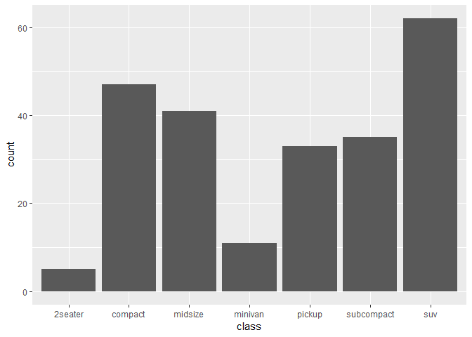

Introduction to R
================
Lukáš ‘hejtmy’ Hejtmánek
21/07/2019

# Overview

Benefits - It’s free\!\!\! - It’s multi platform - It’s actively
developed - It has wide community of package developpers, online support
- It has command line - interpretted language - It can draw beautiful
graphs - It’s easy unlike other programming languages - It’s made for
numerical analysis (unlike python) - It has elegant code (unlike spss)
and is generally more powerfull - It can deal with any data - parsing
webpages, loading sql, loading data from google sheets etc.

Cons - learning curve - in the beginning, takes getting used to and
takes longer than SPSS or excel - limited visual

## Demostrations

[Ebola data](https://gallery.shinyapps.io/Ebola-Dynamic/) [Bus
data](https://gallery.shinyapps.io/086-bus-dashboard/) [Lego
sets](https://shiny.rstudio.com/gallery/lego-set.html) [Movie
data](https://shiny.rstudio.com/gallery/movie-explorer.html)

## Your way around R studio

  - Environemtn
  - text editor
  - console
  - terminal
  - History
  - File manager
  - Global options/project options

## Variables and functions

Examples of variables and functions

``` r
number <- -5
abs(number)
```

    ## [1] 5

``` r
log(abs(number))
```

    ## [1] 1.609438

``` r
exp(number)
```

    ## [1] 0.006737947

``` r
char <- "hello all"
toupper(char)
```

    ## [1] "HELLO ALL"

``` r
paste(char, "you in here")
```

    ## [1] "hello all you in here"

``` r
vec <- 1:100
floor(vec)
```

    ##   [1]   1   2   3   4   5   6   7   8   9  10  11  12  13  14  15  16  17
    ##  [18]  18  19  20  21  22  23  24  25  26  27  28  29  30  31  32  33  34
    ##  [35]  35  36  37  38  39  40  41  42  43  44  45  46  47  48  49  50  51
    ##  [52]  52  53  54  55  56  57  58  59  60  61  62  63  64  65  66  67  68
    ##  [69]  69  70  71  72  73  74  75  76  77  78  79  80  81  82  83  84  85
    ##  [86]  86  87  88  89  90  91  92  93  94  95  96  97  98  99 100

Many of the basic functions can be found
[here](statmethods.net/management/functions.html)

## Help in R and online

You can get help to any function in R by typing ?

``` r
# ?read.csv
```

# Packages

Packages are basically packaged functions and sometimes data

``` r
library(ggplot2)
```

    ## Registered S3 methods overwritten by 'ggplot2':
    ##   method         from 
    ##   [.quosures     rlang
    ##   c.quosures     rlang
    ##   print.quosures rlang

``` r
# install.packages("psych")
```

# Script example and breakdown

``` r
library(ggplot2)
head(mpg) #function
```

    ## # A tibble: 6 x 11
    ##   manufacturer model displ  year   cyl trans  drv     cty   hwy fl    class
    ##   <chr>        <chr> <dbl> <int> <int> <chr>  <chr> <int> <int> <chr> <chr>
    ## 1 audi         a4      1.8  1999     4 auto(~ f        18    29 p     comp~
    ## 2 audi         a4      1.8  1999     4 manua~ f        21    29 p     comp~
    ## 3 audi         a4      2    2008     4 manua~ f        20    31 p     comp~
    ## 4 audi         a4      2    2008     4 auto(~ f        21    30 p     comp~
    ## 5 audi         a4      2.8  1999     6 auto(~ f        16    26 p     comp~
    ## 6 audi         a4      2.8  1999     6 manua~ f        18    26 p     comp~

``` r
str(mpg)
```

    ## Classes 'tbl_df', 'tbl' and 'data.frame':    234 obs. of  11 variables:
    ##  $ manufacturer: chr  "audi" "audi" "audi" "audi" ...
    ##  $ model       : chr  "a4" "a4" "a4" "a4" ...
    ##  $ displ       : num  1.8 1.8 2 2 2.8 2.8 3.1 1.8 1.8 2 ...
    ##  $ year        : int  1999 1999 2008 2008 1999 1999 2008 1999 1999 2008 ...
    ##  $ cyl         : int  4 4 4 4 6 6 6 4 4 4 ...
    ##  $ trans       : chr  "auto(l5)" "manual(m5)" "manual(m6)" "auto(av)" ...
    ##  $ drv         : chr  "f" "f" "f" "f" ...
    ##  $ cty         : int  18 21 20 21 16 18 18 18 16 20 ...
    ##  $ hwy         : int  29 29 31 30 26 26 27 26 25 28 ...
    ##  $ fl          : chr  "p" "p" "p" "p" ...
    ##  $ class       : chr  "compact" "compact" "compact" "compact" ...

``` r
summary(mpg) #function
```

    ##  manufacturer          model               displ            year     
    ##  Length:234         Length:234         Min.   :1.600   Min.   :1999  
    ##  Class :character   Class :character   1st Qu.:2.400   1st Qu.:1999  
    ##  Mode  :character   Mode  :character   Median :3.300   Median :2004  
    ##                                        Mean   :3.472   Mean   :2004  
    ##                                        3rd Qu.:4.600   3rd Qu.:2008  
    ##                                        Max.   :7.000   Max.   :2008  
    ##       cyl           trans               drv                 cty       
    ##  Min.   :4.000   Length:234         Length:234         Min.   : 9.00  
    ##  1st Qu.:4.000   Class :character   Class :character   1st Qu.:14.00  
    ##  Median :6.000   Mode  :character   Mode  :character   Median :17.00  
    ##  Mean   :5.889                                         Mean   :16.86  
    ##  3rd Qu.:8.000                                         3rd Qu.:19.00  
    ##  Max.   :8.000                                         Max.   :35.00  
    ##       hwy             fl               class          
    ##  Min.   :12.00   Length:234         Length:234        
    ##  1st Qu.:18.00   Class :character   Class :character  
    ##  Median :24.00   Mode  :character   Mode  :character  
    ##  Mean   :23.44                                        
    ##  3rd Qu.:27.00                                        
    ##  Max.   :44.00

``` r
g <- ggplot(mpg, aes(class))
g + geom_bar()
```

<!-- -->

``` r
mpg <- ggplot2::mpg
# fitting simple anova model
cty_man_aov <- aov(cty ~ manufacturer, mpg)
summary(cty_man_aov)
```

    ##               Df Sum Sq Mean Sq F value Pr(>F)    
    ## manufacturer  14   2348  167.70   19.61 <2e-16 ***
    ## Residuals    219   1873    8.55                   
    ## ---
    ## Signif. codes:  0 '***' 0.001 '**' 0.01 '*' 0.05 '.' 0.1 ' ' 1

``` r
g <- ggplot(mpg, aes(manufacturer, cty))
g + geom_boxplot()
```

<!-- -->

# Coding style and recommendation

Why coding style is important - easilly readable and understandable
(it’s like using a weird font if you don’t follow instructions) -
having constraints is often actually good - you don’t have to “figure
things out”

General recommendations: - watch what I do :) - copy well to the last
comma and last space

Coding style is described here
