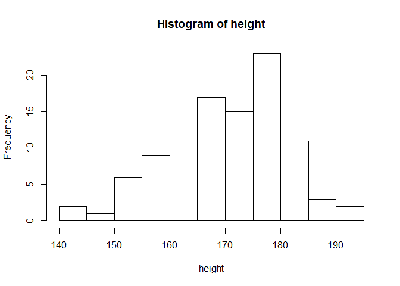
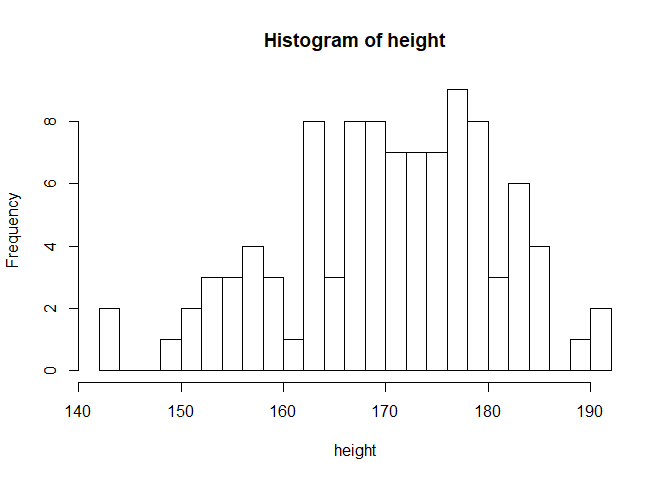
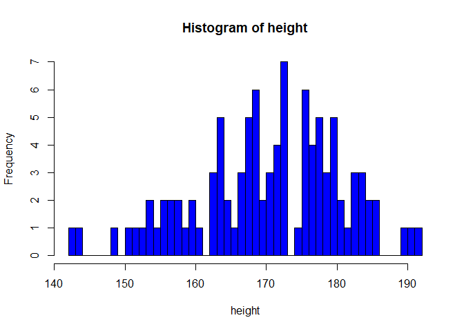
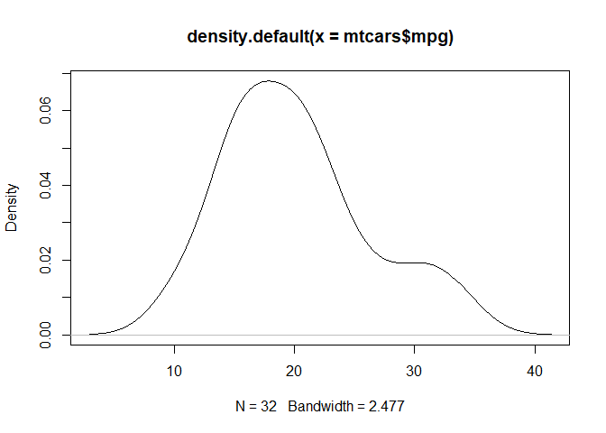
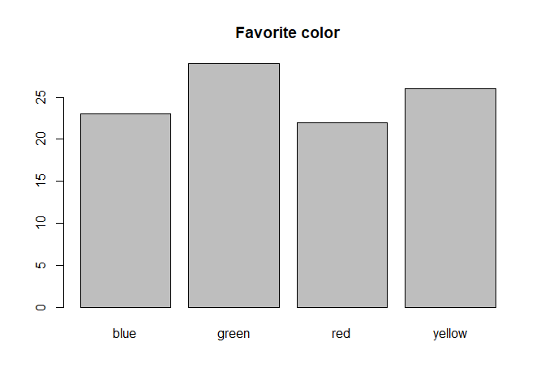
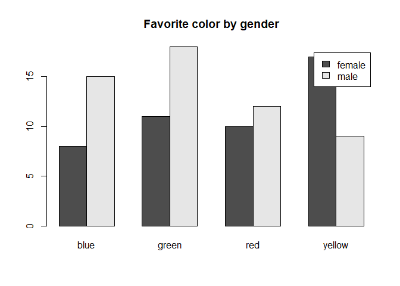
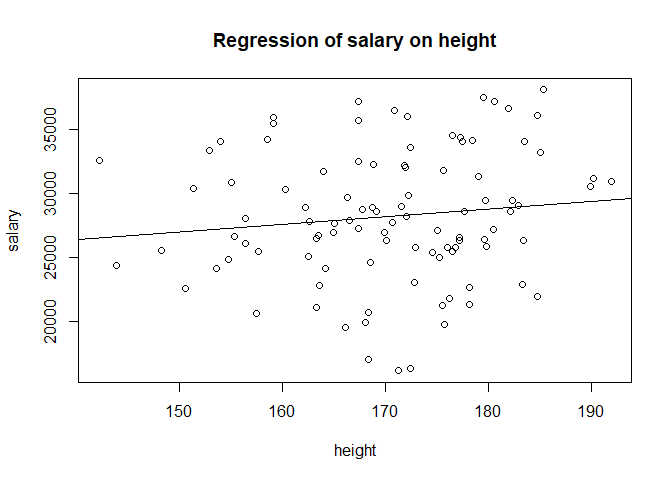
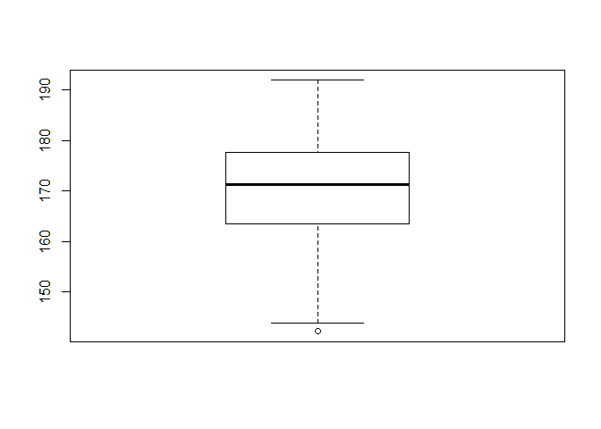

Vector statistics
================
Lukáš ‘hejtmy’ Hejtmánek
21/07/2019

# Vector statistics

Let’s create data first

Task: - set seed of 666 - create a vector of length 100 likes\_blue of
randomized TRUE and FALSE - create a vector of length 100
favorite\_color of randomized (“red”, “green”, “yellow”, “blue”) -
create a vector of length 100 gender of randomized “male”, “female” -
create a vector of length 100 height with a mean of 170 and SD 10 (use
function rnorm) - create a vector of length 100 salary with a mean of
29000 and SD 5000 - create a vector of length 100 hours\_slept wchih is
an uniform sample from 5-11

``` r
set.seed(666)
likes_blue <- sample(c(T,F), 100, replace=T)
favorite_color <- sample(c("red", "green", "yellow", "blue"), 100, replace=T)
gender <- sample(c("female", "male"), 100, replace=T)
height <- rnorm(100, 170, 10)
salary <- rnorm(100, 29000 , 5000)
hours_slept <- sample(5:11, 100, replace=T)
```

Summaries of the variables

``` r
table(likes_blue)
```

    ## likes_blue
    ## FALSE  TRUE 
    ##    59    41

``` r
table(gender)
```

    ## gender
    ## female   male 
    ##     46     54

``` r
summary(height)
```

    ##    Min. 1st Qu.  Median    Mean 3rd Qu.    Max. 
    ##   142.2   163.5   171.4   170.2   177.5   191.9

``` r
summary(hours_slept)
```

    ##    Min. 1st Qu.  Median    Mean 3rd Qu.    Max. 
    ##    5.00    6.00    7.00    7.68    9.25   11.00

## Basic statistical tests

``` r
cor(salary, height)
```

    ## [1] 0.1239847

``` r
t.test(salary ~ gender)
```

    ## 
    ##  Welch Two Sample t-test
    ## 
    ## data:  salary by gender
    ## t = -0.77559, df = 90.003, p-value = 0.44
    ## alternative hypothesis: true difference in means is not equal to 0
    ## 95 percent confidence interval:
    ##  -2863.706  1255.563
    ## sample estimates:
    ## mean in group female   mean in group male 
    ##             27771.78             28575.85

``` r
lm_salary_height <- lm(salary ~ height)
summary(lm_salary_height)
```

    ## 
    ## Call:
    ## lm(formula = salary ~ height)
    ## 
    ## Residuals:
    ##      Min       1Q   Median       3Q      Max 
    ## -12127.1  -2853.6   -183.2   3873.9   9138.1 
    ## 
    ## Coefficients:
    ##             Estimate Std. Error t value Pr(>|t|)  
    ## (Intercept) 17882.96    8361.16   2.139   0.0349 *
    ## height         60.65      49.03   1.237   0.2191  
    ## ---
    ## Signif. codes:  0 '***' 0.001 '**' 0.01 '*' 0.05 '.' 0.1 ' ' 1
    ## 
    ## Residual standard error: 5086 on 98 degrees of freedom
    ## Multiple R-squared:  0.01537,    Adjusted R-squared:  0.005325 
    ## F-statistic:  1.53 on 1 and 98 DF,  p-value: 0.2191

``` r
summary(aov(salary ~ favorite_color))
```

    ##                Df    Sum Sq  Mean Sq F value Pr(>F)
    ## favorite_color  3 1.193e+08 39755805   1.554  0.206
    ## Residuals      96 2.456e+09 25578637

## Subsetting things

Tasks - what is the mean hours slept for people who like blue? - what is
the distributions of fravorite colors for people with salary above 35k?
- does the correlation change between salary adn height between women
and men?

## Plotting things

### Histogram

``` r
hist(height)
```

<!-- -->

``` r
hist(height, breaks = 20)
```

<!-- -->

``` r
hist(height, breaks = 50,  col="blue")
```

<!-- -->

``` r
d <- density(mtcars$mpg) # returns the density data 
plot(d) # plots the results
```

<!-- -->

### Bar plot

``` r
counts <- table(favorite_color)
barplot(counts, main="Favorite color")
```

<!-- -->

``` r
counts <- table(gender, favorite_color)
barplot(counts, main="Favorite color by gender", beside=TRUE, legend=rownames(counts))
```

<!-- -->

### Scatter plot

``` r
plot(height, salary)
abline(lm(salary ~ height))
title("Regression of salary on height")
```

<!-- -->

Tasks - plot salary as an effect of hours slept - plot two separate
plots (one after another) for salary as an effect of height separately
for males and females

### Boxplots

``` r
boxplot(height)
```

<!-- -->

## Creating new variables

When we use certain “search” often, we might as well save it in an
variable

Task - create new variable height\_180 is “height \> 180” - create new
variable dislike\_red wchih is for people who didn’t say they like “red”
- create new variable female\_blue which is true for females who like
blue color

``` r
height_180 <- height > 180
dislike_red <- favorite_color != "red"
female_blue <- gender=="female" & favorite_color == "blue"
```
